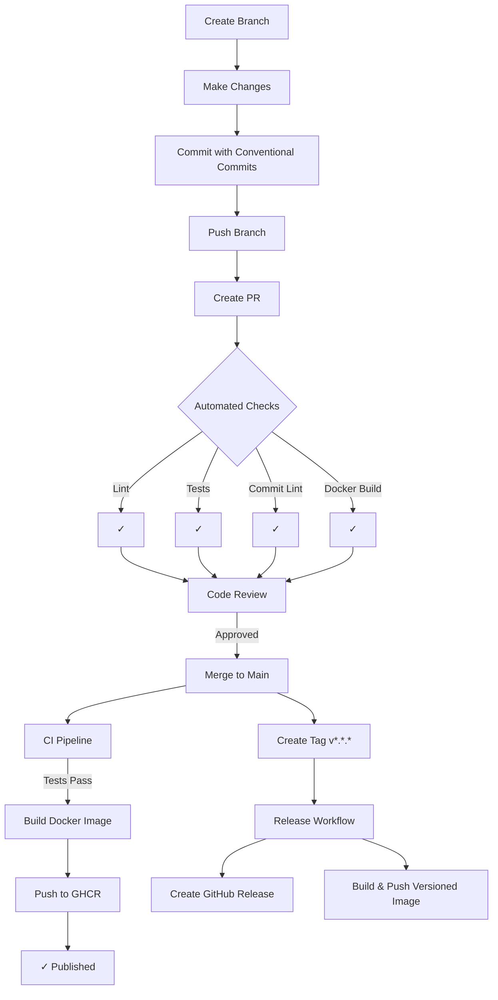

# Branch Protection Rules

This document describes the recommended branch protection rules for the LLM Gateway repository.

## Main Branch Protection

Configure these rules in GitHub Settings → Branches → Branch protection rules → Add rule for `main`:

### Required Checks

- [x] **Require a pull request before merging**
  - [x] Require approvals: 1
  - [x] Dismiss stale pull request approvals when new commits are pushed
  - [x] Require review from Code Owners (if using CODEOWNERS file)

- [x] **Require status checks to pass before merging**
  Required checks:
  - `Lint & Type Check / lint`
  - `Python Tests / test-python`
  - `Build Docker Image / build-docker`
  - `Commit Lint / commitlint` (for PRs)

- [x] **Require branches to be up to date before merging**

- [x] **Require linear history**
  - Ensures clean git history with rebase instead of merge commits

### Additional Settings

- [x] **Require signed commits** (optional, recommended for production)
- [x] **Include administrators** (optional, enforces rules for admins too)

- [x] **Restrict who can push to matching branches**
  - Limit to specific users/teams if needed

- [ ] **Allow force pushes** - **NOT RECOMMENDED**
- [ ] **Allow deletions** - **NOT RECOMMENDED**

## Branch Naming Convention

Follow these naming conventions for branches:

- `feature/description` - New features (e.g., `feature/add-rate-limiting`)
- `fix/description` - Bug fixes (e.g., `fix/streaming-tokens`)
- `docs/description` - Documentation changes (e.g., `docs/update-readme`)
- `refactor/description` - Code refactoring (e.g., `refactor/database-layer`)
- `test/description` - Test improvements (e.g., `test/add-unit-tests`)
- `chore/description` - Maintenance tasks (e.g., `chore/update-dependencies`)

## Commit Message Convention

Follow [Conventional Commits](https://www.conventionalcommits.org/):

```
<type>(<scope>): <subject>

<body>

<footer>
```

### Types

- `feat`: New feature
- `fix`: Bug fix
- `docs`: Documentation changes
- `style`: Code style changes (formatting, semicolons, etc.)
- `refactor`: Code refactoring
- `perf`: Performance improvements
- `test`: Adding or updating tests
- `build`: Build system or dependency changes
- `ci`: CI/CD configuration changes
- `chore`: Other changes that don't modify src or test files
- `revert`: Revert a previous commit

### Examples

```
feat(api): add rate limiting middleware

Add configurable rate limiting per virtual key to prevent abuse.
Supports both request rate and token rate limits.

Closes #42
```

```
fix(streaming): correct token counting for cached tokens

The streaming handler was not correctly accounting for cached tokens
in the usage metadata, causing incorrect cost calculations.

Fixes #87
```

```
docs(agents): update AGENTS.md with testing guidelines

Add section on pytest usage and test file naming conventions.
```

## Release Process

1. **Create a release branch** (optional):
   ```bash
   git checkout -b release/v1.2.0
   ```

2. **Update version** in `pyproject.toml` and any relevant files

3. **Create a pull request** to main with:
   - Version bump
   - Changelog updates (if maintaining CHANGELOG.md)
   - Any final documentation updates

4. **After PR merge**, create and push a tag:
   ```bash
   git checkout main
   git pull
   git tag -a v1.2.0 -m "Release v1.2.0"
   git push origin v1.2.0
   ```

5. **Automated release**:
   - GitHub Release workflow triggers automatically
   - Docker image is built and pushed with version tag
   - GitHub Release is created with auto-generated changelog

## Code Owners (Optional)

Create a `.github/CODEOWNERS` file to automatically request reviews:

```
# Default owners for everything
*       @rohitpaul

# Database changes require review
/app/database.py @rohitpaul

# CI/CD changes
/.github/workflows/ @rohitpaul
```

## Workflow Summary



## Setting Up Branch Protection

1. Go to repository Settings → Branches
2. Click "Add rule"
3. Branch name pattern: `main`
4. Configure rules as described above
5. Click "Create"

## Enforcing Commit Message Format

The commit-lint.yml workflow automatically validates commit messages in PRs. To validate locally:

```bash
# Install commitlint
npm install -g @commitlint/cli @commitlint/config-conventional

# Validate last commit
echo "your commit message" | commitlint

# Validate commits in a range
commitlint --from HEAD~3 --to HEAD
```

## Pre-commit Hooks (Optional)

Install pre-commit to validate commits locally:

```bash
pip install pre-commit

# Create .pre-commit-config.yaml
cat > .pre-commit-config.yaml <<'EOF'
repos:
  - repo: https://github.com/compilerla/conventional-pre-commit
    rev: v3.0.0
    hooks:
      - id: conventional-pre-commit
        stages: [commit-msg]
EOF

# Install hooks
pre-commit install --commit-msg-hook
```
